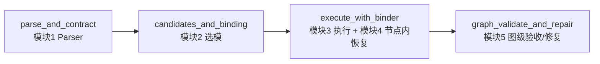

# DEWO-code

本仓库 **DEWO-code** 实现论文中的 **DEWO**（*An LLM-Based Agent System for Dynamic Model Hubs and Real-World Inference Services*）主体流水线：基于 **LangGraph** 将用户 **自然语言 query** 与 **多模态 inputs** 转为 **Hugging Face 推理 DAG**，完成检索选模、逐节点 Binder 组参、在线 `infer` 调用，并在图级做一次验收与可选修复。控制器 LLM 通过 **LiteLLM** 接入；底层推理与 Hub 工具由 **`research/common/tools_hf.py`** 实现，`DEWO-code/app/tools/tool_hf.py` 对其做路径修正后的再导出。

本文档描述**当前实现**；若代码迭代，请以源码为准并同步更新本节。

---

## 目录

- [1. 目标与能力边界](#1-目标与能力边界)
- [2. 系统架构与数据流](#2-系统架构与数据流)
- [3. 目录结构](#3-目录结构)
- [4. 依赖与环境](#4-依赖与环境)
- [5. 配置说明（`app/configs.py`）](#5-配置说明appconfigspy)
- [6. 主状态 `OverallState`](#6-主状态-overallstate)
- [7. 模块说明](#7-模块说明)
- [7.7 深度机制说明（选模/修复/并行）](#77-深度机制说明选模修复并行)
- [8. Runner 与样本格式](#8-runner-与样本格式)
- [9. 日志与产物](#9-日志与产物)
- [10. 用量统计 `usage`](#10-用量统计-usage)
- [11. 测试](#11-测试)
- [12. 调试与排障](#12-调试与排障)
- [13. 附录：DAG / 绑定 / 轨迹 JSON 形态](#13-附录dag--绑定--轨迹-json-形态)

---

## 1. 目标与能力边界

**目标**

- 用单一 **LangGraph 主图**串联：规划 DAG → 为每节点发现/排序候选模型并绑定 → 按依赖执行 DAG → 图级验收与有限次修复。
- 执行阶段用 **运行时 Binder**（LLM + 规则回退）生成每个节点的 `infer(...)` 实参，并用 `dag_plan.task_specs` 中的 `required_args` 做约束。
- 节点内失败时由 **模块 4**（`recovery.py`）做参数修复、同模型瞬时重试、换模等，轨迹写入 `execution_trace`。

**非目标 / 局限（实现层）**

- 控制器仅支持 **`configs.controller["litellm"]`** 一种路径，需自行配置网关与 API Key 环境变量。
- `final_output_candidate` 当前策略为：**第一个汇点（sink）节点**的输出；多汇点 DAG 时需自行解读 `node_outputs`。
- 图级修复轮数由 `baseline_budget.module5_max_graph_repair_rounds` 限制；达到上限后有「最后一次验收」逻辑（见 `graph_repair.py`）。

---

## 2. 系统架构与数据流

### 2.1 主图（模块 1 → 2 → 3 → 5）

入口：`app/utils/graph_builder.py` → `build_dewo_main_graph()` / `build_dewo_main_runnable()`。



- **模块 4** 不单独作为主图节点；它在 **模块 3** 每个 DAG 节点的执行函数内部通过 `run_node_recovery()` 调用。
- **模块 5** 在验收失败时可能 **再次调用** 模块 1/2/3（全量重跑或补丁后增量重跑），详见下文。

### 2.2 端到端数据流（简图）

```text
query + inputs
    → dag_plan（含 task_specs）
    → candidate_frontier + binding_plan
    → 动态 StateGraph：逐节点 Binder → infer（含 recovery）
    → node_outputs, execution_trace, final_output_candidate
    → final_dag_result 组装 → 图级 LLM 验收 → 可选：重规划 / 打补丁 / 增量重跑
```

---

## 3. 目录结构

```text
DEWO-code/
├── run.py                 # CLI：读 jsonl，跑主图，落盘日志
├── README.md
├── app/
│   ├── configs.py         # 全局配置（预算、任务白名单、控制器 LLM）
│   ├── state.py           # OverallState
│   ├── assets/            # model_info / model_card 等本地缓存（模块2）
│   ├── agent/
│   │   ├── parser.py      # 模块1
│   │   ├── candidates.py  # 模块2
│   │   ├── execution.py   # 模块3
│   │   ├── recovery.py    # 模块4（节点级）
│   │   └── graph_repair.py # 模块5
│   ├── tools/
│   │   ├── tool_hf.py     # 重导出 research.common.tools_hf
│   │   ├── dewo_logging.py
│   │   └── run_logging.py
│   └── utils/
│       ├── graph_builder.py
│       ├── controller_retry.py
│       ├── usage.py
│       ├── json_safe.py
│       └── hf_model_metadata_cache.py
└── outputs/               # 运行 `run.py` 后生成（每样本子目录）
```

---

## 4. 依赖与环境

一键安装（版本见仓库内锁定清单）：

```bash
pip install -r requirements.txt
```

**Python 包（核心）**

- `langgraph`
- `langchain_core`
- `langchain_litellm`（优先）或回退 `langchain_community` 中的 `ChatLiteLLM`
- `typing_extensions`

**仓库内模块**

- 运行 `run.py` 时会将 **DEWO-code 根目录**与**上一级项目根**（含 `research/common` 的 monorepo 根）加入 `sys.path`，以便 `import app` 与 `import research.common`。

**环境变量（示例）**

- 控制器：`configs.controller["litellm"]["api_key_env"]`（默认名为 `DEEPSEEK_API_KEY`，以你当前 `configs.py` 为准）。
- Hugging Face 推理：由 `research/common/tools_hf` 决定（常见为 `HF_TOKEN` 等，以该模块说明为准）。
- 调试：`DEWO_DEBUG=1`（各模块 `_dbg` 打印）。

**执行期目录**

- 模块 3 若提供 `infer_assets_dir`，会将其解析为绝对路径并写入环境变量 **`TOOL_ASSETS_DIR`**，供推理工具写入媒体产物；运行结束会恢复旧值。

---

## 5. 配置说明（`app/configs.py`）

| 符号 | 作用 |
|------|------|
| `module2_use_model_card_for_binding` | `True`：拉取 model card 并由 LLM 做最终绑定；`False`：用 frontier Top-K 直接构造 `binding_plan`。 |
| `input_assets_base_dir` | 样本 `inputs` 中**相对路径**拼接到该目录（仅当文件存在时），用于本地评测资源。 |
| `baseline_budget` | **实验预算单一来源**：检索 K、TOP-K、`infer_timeout_s`、`controller_max_retries`、模块 2 元数据缓存开关与刷新阈值、模块 4 重试/修参轮数、模块 5 最大修复轮数等。 |
| `supported_tasks` | 模块 1 提示词中的 **task_type 白名单**（与 `infer` 支持的任务类型对齐）。 |
| `controller["litellm"]` | `model_id`、`api_base`、`api_key_env`、`temperature`、`top_p` 等。 |

修改配置后无需改代码即可切换网关与密钥环境变量名。

---

## 6. 主状态 `OverallState`

定义见 `app/state.py`（`TypedDict`，`total=False`）。字段按功能分组如下。

**样本与输入**

- `run_id`, `sample_id`, `query`, `inputs`, `inputs_meta`, `datasets_meta`
- `infer_assets_dir`：本样本推理产物目录（绝对路径）

**模块 1–3 主产物**

- `dag_plan`：`graph_type`, `nodes`, `edges`, `task_specs`, …
- `candidate_frontier`, `binding_plan`
- `node_outputs`, `execution_trace`, `final_output_candidate`

**模块 5**

- `final_dag_result`：验收用「DAG + 每节点 node_output」视图
- `graph_eval`：`is_satisfied`, `graph_error_type`, `reason`, `format_requirement_detected`, `final_result`, …
- `dag_patch`, `affected_nodes`, `reused_node_outputs`, `graph_repair_trace`, `graph_final_message`
- `module5_replan_guidance`：意图错误时注入模块 1 的二次规划说明
- **临时字段**（模块 3 返回前会 `pop`）：`module5_execute_only_nodes`, `module5_seed_node_outputs`

**可观测性**

- `usage`：见下一节
- `usage_pending_trigger`, `usage_m5_round`：用于标记本轮 pass / 模块 5 轮次（供 usage 与 LLM 事件打标）

---

## 7. 模块说明

### 7.1 模块 1 — `parser.py`（`parse_and_contract`）

- 读 `query`、`inputs`；可选读 `module5_replan_guidance`（图级「意图误解」后的重规划提示）。
- 调用控制器 LLM，解析为 **单个 JSON 对象**，规范化节点与边，写入 `dag_plan`。
- 按节点中出现的 `task_type` **去重**调用 `inspect_task`（经 `tool_hf`），生成并写入 **`task_specs`**（含 `required_args` 等）。

### 7.2 模块 2 — `candidates.py`（`candidates_and_binding`）

-  per 节点：`search_models`、`get_model_info`（及可选 `get_model_card`），结合打分与 LLM 语义对齐分，形成 **`candidate_frontier`**。
- 根据 `module2_use_model_card_for_binding` 决定是否走 LLM 最终排序，产出 **`binding_plan`**（`best` + `backups`）。
- 支持 **`app/utils/hf_model_metadata_cache.py`** + `app/assets/model_info/` 下 JSON 缓存，减少 Hub 请求（行为由 `baseline_budget` 控制）。

### 7.3 模块 3 — `execution.py`（`execute_with_binder`）

- 根据 `dag_plan.nodes` / `edges` **动态构建** LangGraph `StateGraph`（运行时状态：`node_outputs` 合并字典 + `execution_trace` 列表累加）。
- 每个 DAG 节点：可选 **Binder LLM** 生成 `inputs` / `parameters` / `parameters_extra_json`；失败则用 **`_fallback_bind_inputs`** 规则拼装。
- 组装 `infer` 调用（含 `timeout_s`），交给 **模块 4** `run_node_recovery()`。
- 若状态中存在 **`module5_execute_only_nodes`**：仅执行受影响子图，并把 **`module5_seed_node_outputs`** 作为初始 `node_outputs`（用于模块 5 补丁后的增量重跑）。
- **增量重跑依赖语义（关键）**
  - 执行节点集合会被裁剪为 `module5_execute_only_nodes`；
  - 但 `incoming_by_target`（上游依赖索引）基于**完整 DAG**构建，而非执行子图；
  - 因此重跑节点的 `upstream_outputs` 可同时读取：
    - 本轮重跑节点新产出；
    - 未重跑节点在 `module5_seed_node_outputs` 中复用的历史产出。
  - 该语义用于避免“只重跑 node_1 时，node_4 看不到 node_2/node_3 复用输出”的上下文丢失问题。

### 7.4 模块 4 — `recovery.py`（`run_node_recovery`）

- 子图：`prepare_attempt` → `run_infer` → 条件边 → `repair_params` / `retry_same_model` / `switch_model` / `END`。
- `run_infer` 在线程池中执行 `infer(**kwargs)`，并用 `infer_timeout_s` 做**墙钟等待**；超时归类为瞬时错误并走重试逻辑（与文件头注释一致）。
- 失败分类：`classify_infer_failure`（参数/模型不匹配/网络/解析/未知服务端等）。
- 参数修复：规则补丁 + 可选 Binder **`rebind_fn`**（由模块 3 注入）。

### 7.5 模块 5 — `graph_repair.py`（`graph_validate_and_repair`）

- 组装 **`final_dag_result`**，调用图级验收 LLM，得到 **`graph_eval`**。
- **`intent_misunderstanding`**：写入 `module5_replan_guidance`，设置 `usage_pending_trigger`，依次再跑模块 1 → 2 → 3。
- **`workflow_orchestration_error`**：调用补丁 LLM → **`_apply_patch`** 校验并更新 `dag_plan` → 计算下游闭包 **`affected_nodes`** → 合并选模计划 → 设置 `module5_execute_only_nodes` 与 `module5_seed_node_outputs` → 再跑 **模块 3**。
- **`capability_unavailable`**：写入 `graph_final_message` 并结束。
- 补丁操作类型（与测试一致）：`remove_edges`, `add_edges`, `add_node`, `remove_node`, `update_node`, `splice_after`。

### 7.6 横切能力

- **`app/utils/controller_retry.py`**：控制器 LLM 与 HF 调用的重试与瞬时网络错误判断。
- **`app/utils/usage.py`**：`usage` 结构（`schema_version=4`）、各模块 wall、LLM token 累计、`llm_events` 等；**端到端墙钟**依赖 `usage` 内 `_e2e_perf_t0`，避免未声明顶层 state 键被 LangGraph 丢弃。

### 7.7 深度机制说明（选模/修复/并行）

本节按实现细节回答 5 个关键问题：模块2如何选模、模块3如何做节点修复、模块5如何做图级修复、两级修复如何平衡、以及 DAG 并行如何落地。

#### 7.7.1 模块2选模细节（`candidates.py`）

- **分段召回与去重**
  - 对每个节点的 `task_type`，将预算 `K` 通过 `_split_k_for_triple_search` 分配给三路检索：`trending_score`、`downloads`、`likes`。
  - 三路结果按“趋势 -> 下载 -> 点赞”的顺序去重合并，得到该节点候选池。
- **模型元数据获取与缓存**
  - 先取 `model_id` 列表，再通过 `resolve_model_infos` 读取 `model_info`：优先本地缓存，缓存缺失或达到刷新阈值时才远程拉取。
  - 缓存开关与刷新阈值由 `baseline_budget.module2_metadata_cache_enabled` / `module2_model_info_cache_refresh_after_accesses` 控制。
- **候选评分分解**
  - 先计算四项结构化分数：`S_exec`（可执行性）、`S_stab`（稳定性）、`S_act`（活跃度）、`S_fresh`（新鲜度）。
  - 再调用 LLM 对每个候选生成 `S_align_sem`（语义贴合度 + 中文理由）。
  - 最终 `prior_score` 线性加权：
    - `0.30*S_exec + 0.25*S_align + 0.20*S_stab + 0.15*S_act + 0.10*S_fresh`
  - `cand_list` 按 `prior_score` 降序，形成 `candidate_frontier.by_node_id[node_id]`。
- **BindingPlan 生成的两种路径**
  - `module2_use_model_card_for_binding=False`（当前默认）：直接取 `top_candidates[:TOP-K]`，`best=top1`，其余为 `backups`。
  - `module2_use_model_card_for_binding=True`：先拉取 Top-K 的 `model_card`（同样支持缓存），再由排序 LLM 输出 `best/backups`；若 LLM 输出未覆盖全部候选，会按 `prior_score` 自动补齐，保证可执行。
- **并行粒度**
  - 模块2按节点并发处理，`ThreadPoolExecutor(max_workers=min(4, len(valid_nodes)))`。
  - 每个 worker 独立初始化 LLM，避免共享实例的线程安全问题。

#### 7.7.2 模块3节点修复机制细节（`execution.py` + `recovery.py`）

- **模块3执行与模块4恢复的关系**
  - 模块3是动态 DAG 执行器；每个节点在执行时都调用模块4 `run_node_recovery()`。
  - 因此“节点级修复”是内嵌在模块3节点函数里的实时机制，而非图跑完后再补救。
- **跨轮记忆（Phase A）**
  - 模块3会从 `state.execution_trace` 中按 `node_id + task_type` 过滤历史尝试，转换为 `attempt_history` 并注入模块4（`initial_attempt_history`）。
  - 注入历史包含成功与失败尝试（`success=True/False`、`infer_call_args`、`failure_class`、`error`）。
  - 注入前会裁剪窗口（当前实现保留最近 20 条）以控制上下文长度。
- **节点参数生成（Binder）**
  - 优先调用 Binder LLM 生成 `inputs/parameters/parameters_extra_json/notes`。
  - 若 Binder 输出不合格或异常，退回 `_fallback_bind_inputs` 规则组参。
  - 即便必填参数缺失，也不会在模块3直接失败，而是交给模块4尝试修参。
- **模块4子图结构**
  - `prepare_attempt -> run_infer -> {repair_params | retry_same_model | switch_model | END}`
  - 成功即 `END`；失败由 `failure_class` 驱动路由：
    - `param_build`：优先修参（规则修参 + 可选 Binder 修参回调）
    - `transient_infra`：同模型瞬时重试，达到阈值后换模
    - `model_task_mismatch / response_parse / server_unknown`：直接换模
- **多模型与重试预算**
  - `candidate_models = best + backups (+ frontier补位)`，去重后作为换模队列。
  - `max_attempts = min(len(uniq_models), 1 + module4_max_model_retries)`。
  - 同模型重试由 `module4_max_transient_retries` 与 `module4_transient_backoff_ms` 控制。
  - 参数修复轮数由 `module4_max_param_fix_rounds` 控制。
- **可观测性**
  - 每次尝试都会追加 `trace_steps`（含 `repair_action/failure_class/infer_call/latency/error`）。
  - 最终模块3回写统一 `execution_trace`，下游模块5和日志系统可直接消费。

#### 7.7.3 模块5图级修复细节（`graph_repair.py`）

- **图级验收对象**
  - 先构造 `final_dag_result`：当前 `dag_plan` + 每个节点 `node_output`。
  - 图级验收 LLM 输出 `graph_eval`（`is_satisfied/graph_error_type/reason/final_result`）。
- **错误类型驱动两条修复路径**
  - `intent_misunderstanding`：
    - 将 `final_result` 写入 `module5_replan_guidance`；
    - 全量重跑：模块1 -> 模块2 -> 模块3。
  - `workflow_orchestration_error`：
    - 调用补丁 LLM 生成 `dag_patch.operations`；
    - `_apply_patch` 校验并更新 `dag_plan`；
    - 计算 `affected_nodes` 下游闭包，仅增量重跑受影响子图。
- **补丁能力**
  - 支持 6 种操作：`remove_edges/add_edges/add_node/remove_node/update_node/splice_after`。
  - 补丁后会做 DAG 合法性校验：节点唯一、边端点有效、无环（Kahn）。
- **增量重跑前的选模策略**
  - `_merge_node_model_plans` 对受影响节点做“必要重选模”：
    - 新增节点或 task 变化节点：增量调用模块2重选。
    - task 未变节点：优先复用原计划，并结合历史执行结果做保守淘汰：
      - 仅淘汰 **fail-only** 模型（出现失败且从未成功）；
      - 若同一模型既有失败也有成功，则保留；
      - 从 `candidate_frontier` 补位时优先补入历史成功模型；
      - 最终 `binding_plan` 中将成功模型前置（优先落在 `best`）。
- **轮次控制与最后补验**
  - 修复轮次由 `module5_max_graph_repair_rounds` 控制。
  - 达到上限后仍会执行“最后一次验收”，避免漏判“最后一轮修完其实已成功”的情况。

#### 7.7.4 节点修复与图级修复的平衡策略

- **先局部、后全局**
  - 节点内错误（参数、临时网络、模型不兼容）优先在模块4闭环，减少全图重跑成本。
  - 只有图级验收认为“意图错”或“编排错”时，才升级到模块5全局修复。
- **职责分层**
  - 模块4解决“单节点可执行性问题”（参数/模型/请求层）。
  - 模块5解决“跨节点编排问题”（依赖关系、阶段缺失、错误汇聚路径）。
- **成本控制**
  - 模块5 的 `affected_nodes + seed_node_outputs` 机制让补丁路径尽量只重跑受影响子图，未受影响节点直接复用。
  - 模块4 的换模队列与同模瞬时重试上限，避免在坏模型或坏参数上无穷循环。
- **工程上的默认平衡**
  - 当前配置 `module4_max_param_fix_rounds=3`、`module4_max_model_retries=5`、`module5_max_graph_repair_rounds=1` 倾向“先把节点打磨好，再做有限图级重构”。

#### 7.7.5 项目 DAG 并行细节

- **主图级别**
  - 主链固定串行：模块1 -> 模块2 -> 模块3 -> 模块5（`graph_builder.py`）。
  - 并行主要发生在模块2和模块3内部，而非主图节点之间。
- **模块2并行（节点级）**
  - 不同 DAG 节点的候选发现与选模并发执行（线程池）。
  - 适合 I/O 密集阶段（Hub 检索、model_info/card 拉取、LLM打分）。
- **模块3并行（依赖驱动）**
  - 模块3按 `dag_plan.edges` 动态构建 `StateGraph`。
  - 所有入度为 0 的节点从 `START` 同时可执行；无依赖关系的分支可并行推进。
  - 某节点仅在其前驱完成并写入 `node_outputs` 后才触发，天然满足数据依赖。
- **模块5增量并行**
  - 补丁后仅构建受影响子图执行（`module5_execute_only_nodes`），保留原依赖关系；
  - 受影响子图内仍按 DAG 依赖并行，而非串行逐节点重放。

---

## 8. Runner 与样本格式

**命令**（在 `DEWO-code` 目录下，或将该目录加入 `PYTHONPATH`）：

```powershell
cd DEWO-code
python run.py --data path\to\samples.jsonl --max-samples 0
```

- `--data`：jsonl 路径（默认 `DEWO-code/test.jsonl`，若存在）；兼容旧参数 `--test-jsonl`。
- `--max-samples`：`0` 表示不限制；`>0` 只跑前 N 条。

**每行样本（JSON）常用字段**

- `id`：样本 ID（日志目录名用）
- `query`：字符串
- `inputs`：对象；值可为文本或**相对 `input_assets_base_dir` 的本地路径**（见下）
- 其余键会进入 `datasets_meta`

**路径重定位与 `inputs_meta`**

- 对「看起来像本地相对路径」的字符串（键名如 `image` / `table` 或扩展名符合媒体/表格），若在 `configs.input_assets_base_dir` 下存在对应文件，则替换为**绝对路径**。
- `inputs_meta` 与 `inputs` **同形**：对已解析的本地文件调用 `get_file_info`；表格类在 runner 中转为**列式对象**（表头为键、值为该列数据数组）；非路径叶子为 `skipped` 占位。

**成功判定（Runner 打印）**

- 无异常且最终 state 中 **`dag_plan` 非空** 记为 SUCCESS；无异常但 `dag_plan` 空为 PARTIAL；异常为 ERROR。异常时控制台会打印 **`_run_dewo_graph_streaming` 内捕获的 traceback 文本**（`tb_text`）。

---

## 9. 日志与产物

由 `app/tools/dewo_logging.py` 定义。

**每条样本一个目录**

`DEWO-code/outputs/<sample_id>_<YYYYMMDD_HHMMSS>/`

| 文件 | 内容 |
|------|------|
| `final_state.json` | 流式执行最后一帧的 **OverallState 完整快照**（`default=str` 序列化）。 |
| `main_log.json` | 摘要：`Executed`（终态 DAG 全节点 infer 无 error）、`task_success`（最后一次模块 5 验收 `is_satisfied`）、`crash`、`usage`、`final_dag_result`、`final_result`、`graph_eval_summary` 等。 |

`main_log.json` 的 `schema_version` 当前为 **2**（`MAIN_LOG_SCHEMA_VERSION`）；Runner 层异常（`crash` 非空）时 `Executed` 与 `task_success` 均为 False。

---

## 10. 用量统计 `usage`

实现：`app/utils/usage.py`。

- **`totals.wall_sec`**：端到端墙钟（从首次 `ensure_usage` 到 `finalize_usage_wall`），**不等于**各模块 wall 简单相加（避免嵌套重复计数）。
- **`modules.module1|2|3`**：每趟 pass 的 wall 与 LLM 汇总；**`module5.rounds`**：图级验收轮次。
- **`llm_events`**：单次调用记录（含模块、用途、延迟、可选 `node_id` 等）。
- 模块 5 在 replan / patch 路径上会设置 **`usage_pending_trigger`**，便于在 pass 记录里区分触发原因（用完会在 `graph_repair` 的 `finally` 中清除）。

---

## 11. 测试

在 `DEWO-code` 目录执行：

```powershell
python -m pytest tests -q
```

当前测试文件包括（名称即关注点）：

- `test_graph_patch_apply.py`：图补丁 `_apply_patch` 与六种 operation。
- `test_graph_repair_json_format.py`：模块 5 的 JSON 格式约束兜底与改判逻辑。
- `test_recovery_classify.py`：模块 4 错误归类（`classify_infer_failure`）。
- `test_hf_get_task_info.py`：HF 任务参数元信息（如 `allowed_values`）映射。
- `test_json_safe.py`：`json_safe` 的不可序列化对象兜底行为。
- `test_controller_retry.py`：控制器重试预算与行为。
- `test_usage.py`：`usage` 聚合与模块 5 相关字段。
- `test_main_log.py`：`main_log` 构建与崩溃推断。

---

## 12. 调试与排障

- 设置 **`DEWO_DEBUG=1`** 打开各模块调试打印。
- 常用专项调试开关（按需开启）：
  - `DEWO_DEBUG_PHASEA_HISTORY=1`：打印模块4入场时注入的跨轮 `attempt_history` 规模、成功数与最近模型。
  - `DEWO_DEBUG_SUCCESS_REUSE=1`：打印模块5增量选模时 `success_models/fail_only_models/final_models/best`。
  - `DEWO_DEBUG_BINDER_REPAIR=1`：打印修参阶段 System/Human 消息（摘要）。
  - `DEWO_DEBUG_BINDER_REPAIR_FULL=1`：打印修参阶段完整提示词（System + Human payload 全字段）。
  - `DEWO_DEBUG_BINDER_REPAIR_RESULT=1`：打印修参 LLM 结构化输出摘要（keys + data_prefix）。
  - `DEWO_DEBUG_INCREMENTAL_UPSTREAM=1`：打印增量执行节点的 `upstream_ids`、`node_outputs` 可见键、`upstream_outputs` 实取键。
- Runner 异常：查看终端 traceback + 同目录 `main_log.json` 的 `crash.traceback`。
- 推理无输出：检查 **`HF_TOKEN`**（或 `research` 层要求）、`infer_timeout_s`、以及 `TOOL_ASSETS_DIR` / `infer_assets_dir` 是否可写。
- 修改 **`input_assets_base_dir`** 为当前机器上 **DEWO-Set/assets**（或你的数据集）**资源根目录**，否则相对路径不会重定位。

---

## 13. 附录：DAG / 绑定 / 轨迹 JSON 形态

以下与实现一致，便于对照 `final_state.json`。

### 13.1 `dag_plan`（节选）

```json
{
  "graph_type": "DAG",
  "nodes": [
    {
      "node_id": "node_1",
      "task": ["image_to_image"],
      "language": "en",
      "expected_output_type": "image",
      "json_format": null,
      "input_modalities": ["image"],
      "requirement_spec": "使用原图做风格转换"
    }
  ],
  "edges": [
    {"source": "node_1", "target": "node_2", "edge_type": "data_dep"}
  ],
  "task_specs": {
    "image_to_image": {
      "task_type": "image_to_image",
      "required_args": ["messages"],
      "pipeline_tag": "...",
      "mapped_method": "...",
      "output_type_hint": "...",
      "parameters": {}
    }
  }
}
```

`task_specs` 中具体键以 **`inspect_task`** 返回值为准；失败时可能含 `inspect_error`。

### 13.2 `binding_plan`（节选）

```json
{
  "by_node_id": {
    "node_1": {
      "selected_from_task_type": "image_to_image",
      "best": {"model_id": "org/model", "prior_score": 0.0, "reason": "..."},
      "backups": [{"model_id": "org/other", "prior_score": 0.0, "reason": "..."}]
    }
  },
  "meta": {"generated_at": "..."}
}
```

### 13.3 `execution_trace` / `node_outputs`

- 节点**一次成功**通常对应一条含 `status: ok`、`phase: executed` 的轨迹。
- 经模块 4 多次尝试时，同一逻辑节点可能有多条记录（含 `attempt`、`failure_class`、`repair_action` 等）。
- `node_outputs[node_id]` 为下游可见的**收敛结果**；失败时常为 `{"error": "..."}`。

### 13.4 Binder 产出（写入 infer 前）

典型字段：

```json
{
  "task_type": "text_generation",
  "model": "org/model",
  "inputs": { "messages": [{"role": "user", "content": "..."}] },
  "parameters": {},
  "parameters_extra_json": "{}",
  "timeout_s": 300
}
```

---

## 文档与代码同步

主图入口、状态字段与模块职责以 **`app/utils/graph_builder.py`**、**`app/state.py`** 及 **`app/agent/*.py`** 为准。若你增加节点、修改状态键或日志 schema，请更新本 README 对应小节。
